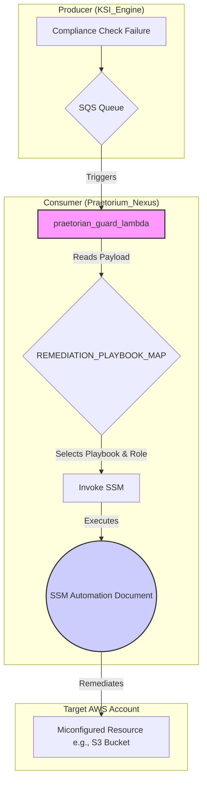

# Praetorium\_Nexus: Automated Enforcement & Remediation (AER) Engine

`Praetorium_Nexus` is the automated enforcement and remediation component of the FedRAMP GRC ecosystem. It fulfills the **KSI-CNA-08** mandate (*Use automated services to... automatically enforce secure operations*).

This repository listens for "compliance drift" signals from producers (like `KSI_Engine`) and automatically executes GRC-as-Code playbooks to return systems to a known-good state.

This project demonstrates the "build-first" GRC Engineering philosophy by treating compliance remediation as a solvable engineering problem, automated via code.

## Core Mission & Architecture

The AER Engine operates on a simple, event-driven, and serverless architecture, ensuring scalability and security.

1.  **Receive:** An SQS Queue (provisioned by `KSI_Engine`) receives a CCE JSON payload when a compliance check *fails*.
2.  **Triage:** An `aws_lambda_event_source_mapping` triggers the `praetorian_guard_lambda` (defined in `/terraform/main.tf`).
3.  **Execute:** The Lambda (defined in `/src/praetorian_guard`) parses the CCE payload, identifies the failed `control_id`, and maps it to the correct SSM Automation Document.
4.  **Enforce:** The Lambda triggers an `ssm:StartAutomationExecution` call, passing the `target_id` (e.g., the S3 bucket name) and a dedicated, least-privilege IAM role to the playbook.
5.  **Audit:** The playbook (e.g., `cm-6_s3_public_access_fix.yml`) executes to fix the misconfiguration. All actions are logged in CloudWatch and SSM Automation history for a complete audit trail.



## GRC-as-Code Playbook Directory

All remediation playbooks are stored as AWS SSM Automation Documents (YAML) and organized by their corresponding NIST 800-53 control family. This provides a "control-to-code" mapping that is auditable, version-controlled, and testable.

```
/remediation_playbooks
├── AC_Access_Control/
├── CM_Configuration_Management/
│   ├── README.md
│   └── cm-6_s3_public_access_fix.yml
├── SC_System_Communications_Protection/
...
```

## Deployment

This engine is deployed via Terraform.

1.  Navigate to the `/terraform` directory.
2.  Create a `terraform.tfvars` file or export environment variables to provide values for the required inputs (see `variables.tf`). Ensure the `ksi_engine_sqs_queue_arn` is set to the output ARN from the `KSI_Engine` deployment.
3.  Run `terraform init`.
4.  Run `terraform plan` to review the proposed changes.
5.  Run `terraform apply` to deploy the resources.

The remediation playbooks (SSM Documents) must be deployed separately, for example, via a CI/CD pipeline or a separate Terraform configuration that registers them with the SSM service.

## Local Development and Testing

The core logic resides in the `praetorian_guard_lambda`. To test changes locally, you can use the AWS SAM CLI or a similar tool to invoke the Lambda function with a sample SQS event payload.

### Sample SQS Event (`events/cm-6_failure.json`)
```json
{
  "Records": [
    {
      "messageId": "19dd0b57-b21e-4ac1-bd88-01bbb068cb78",
      "receiptHandle": "MessageReceiptHandle",
      "body": "{\n  \"control_id\": \"NIST-800-53-CM-6\",\n  \"target_id\": \"arn:aws:s3:::my-insecure-public-bucket\",\n  \"status\": \"FAIL\",\n  \"timestamp\": \"2025-10-23T14:00:00Z\"\n}",
      "attributes": {
        "ApproximateReceiveCount": "1",
        "SentTimestamp": "1523232000000",
        "SenderId": "AIDAISD5555555555555",
        "ApproximateFirstReceiveTimestamp": "1523232000001"
      },
      "messageAttributes": {},
      "md5OfBody": "7b270e59b47ff90a553787216d84d776",
      "eventSource": "aws:sqs",
      "eventSourceARN": "arn:aws:sqs:us-gov-west-1:123456789012:ksi-engine-failures",
      "awsRegion": "us-gov-west-1"
    }
  ]
}
```

You can then run the Lambda function locally:
```bash
sam local invoke praetorian_guard_lambda -e events/cm-6_failure.json --env-vars env.json
```
*Note: You will need to create an `env.json` file containing the necessary environment variables for the Lambda function.*
